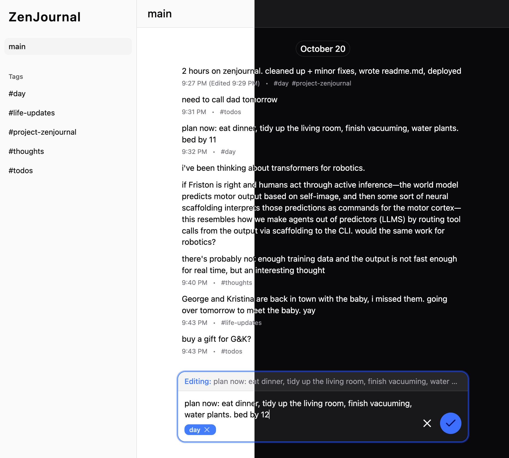

# ZenJournal

A simple journaling app with a message-app-like interface, tags for entries, and local persistence. Built with Vite, React, and ShadcnUI.

Try it out [here](https://zenjournal-app.netlify.app).

## Motivation

For some reason, a message app interface creates less of a psychological hurdle to journaling than a Markdown file for me. I also like to have timestamps for my entries to log throughout the day and see how my day's been going.

I've been using Telegram for journaling, but I'm missing the ability to write my entries in one place, tag them, and then see entries for each tag separately. That's why I created ZenJournal.

## Features roadmap

- [x] Tags get extracted from input text and attached to the entry
- [x] Persistence to localStorage
- [x] Editing and deleting entries
- [ ] Suggestions dropdown with existing tags after typing `#`
- [ ] Renaming and deleting tags
- [ ] Back-up export and import
- [ ] Keyboard navigation

## A note on using the Temporal API

When I travel between timezones (which is not rare), I want to see past entries written on the day and at the time they were written in the original timezone, not in the current timezone—but also preserve the timezone information in the data so that I can recover the exact time instant of the entry. I also want to group entries based on their date (in the original timezone). The `ZonedDateTime`, `PlainTime`, and `PlainDate` classes from the Temporal proposal make this incredibly easy compared to the `Date` class.

I use `superjson` to be able to persist Temporal instances, which I would've had to do for `Date` anyway.

## A note on copying UX from Telegram

When in doubt, I copied behavior from Telegram, e.g. saving and restoring existing drafts when you edit a message, whitespace treatment, displaying the current text of the edited message, etc.
